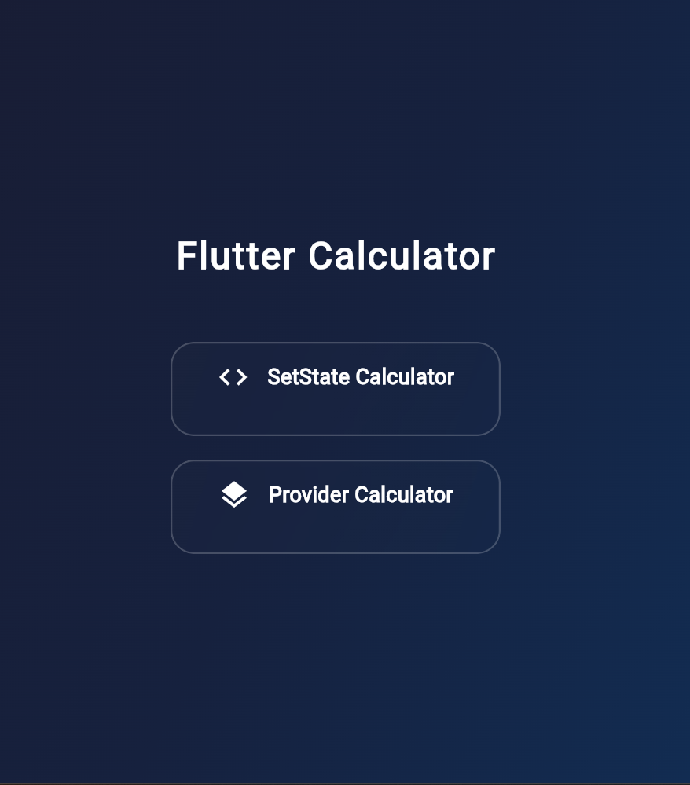
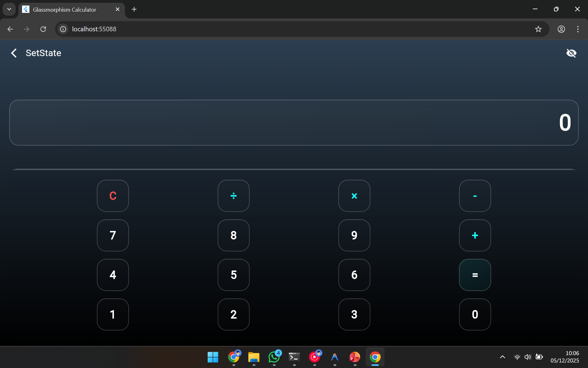
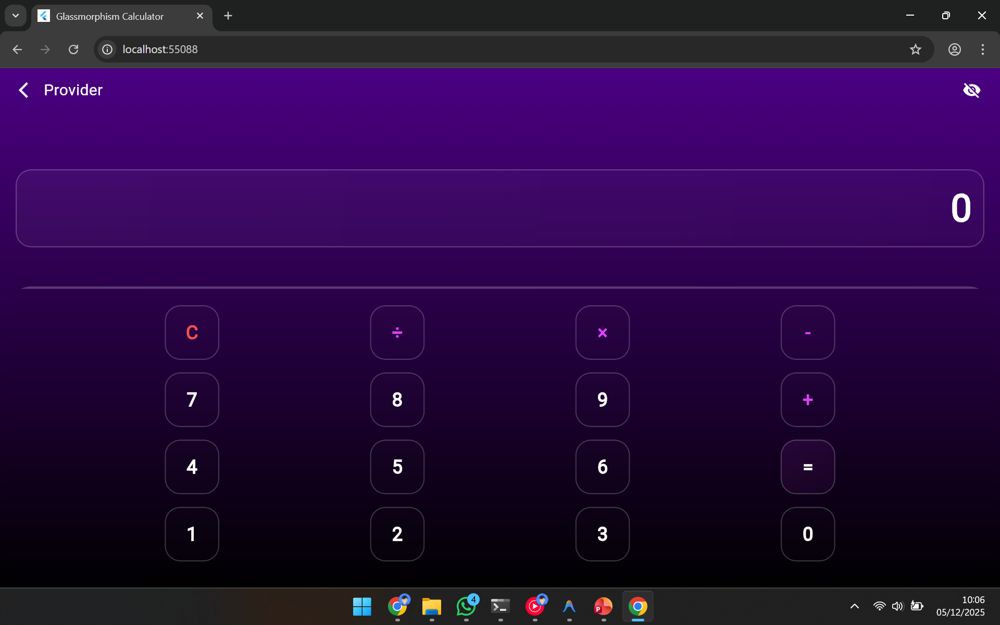

# Flutter Calculator: SetState vs Provider

A stylish Flutter Calculator application designed to demonstrate and compare two fundamental state management approaches: **`setState`** and **`Provider`**.

This project features a premium **Glassmorphism** design and an **Interactive Educational Mode** that visually highlights the differences in widget rebuilding between the two methods.

## ✨ Features

*   **Dual Implementation**:
    *   **SetState Calculator**: Uses the standard `setState` method for local state management.
    *   **Provider Calculator**: Uses the `provider` package for separated business logic and state management.
*   **Glassmorphism UI**:
    *   Modern, frosted glass aesthetic using `BackdropFilter`.
    *   Beautiful gradients and semi-transparent elements.
*   **Interactive Info Mode 🎓**:
    *   Toggle the "Eye" icon to see *exactly* what parts of the screen are rebuilding.
    *   **Visual Feedback**: Red borders flash on rebuilds to demonstrate efficiency.
        *   *SetState*: Flashes the **entire screen** (less efficient).
        *   *Provider*: Flashes **only the display text** (more efficient).

## 📱 Screenshots

| Home Screen | SetState (Rebuild All) | Provider (Rebuild Partial) |
|:---:|:---:|:---:|
|  |  |  |

## 🛠️ Tech Stack`

*   **Flutter** & **Dart**
*   **Provider Package**: `^6.0.0`
*   **UI/UX**: Custom Glassmorphism Widgets

## 📂 Project Structure

```
lib/
├── main.dart                  # Entry point & Theme setup
├── providers/
│   └── calculator_provider.dart # Business logic for Provider version
├── screens/
│   ├── home_screen.dart       # Main menu
│   ├── calculator_setstate_screen.dart # SetState implementation
│   └── calculator_provider_screen.dart # Provider implementation
└── widgets/
    ├── glass_container.dart   # Reusable frosted glass widget
    ├── calculator_button.dart # Styled calculator button
    └── rebuild_indicator.dart # Educational widget for visual feedback
```

## 🚀 Getting Started

1.  **Clone the repository**:
    ```bash
    git clone https://github.com/yourusername/flutter_calculator_provider_setstate.git
    ```

2.  **Install dependencies**:
    ```bash
    cd apps
    flutter pub get
    ```

3.  **Run the app**:
    ```bash
    flutter run
    ```

## 🐳 Docker Support

This project includes Docker support for easy deployment.

1.  **Build and Run with Docker Compose**:
    ```bash
    docker-compose up --build
    ```

2.  **Access the App**:
    Open your browser and navigate to `http://localhost:4040`.

## 🧠 State Management Comparison

| Feature | SetState | Provider |
| :--- | :--- | :--- |
| **Logic Location** | Inside the `State` class (UI & Logic mixed) | Separated in `ChangeNotifier` class |
| **Rebuild Scope** | Rebuilds the entire `build()` method of the widget | Rebuilds only `Consumer` or `Selector` widgets |
| **Performance** | Can be inefficient for complex trees | Highly efficient, minimizes rebuilds |
| **Scalability** | Harder to maintain as app grows | scalable and testable |

## 👨‍💻 Credits

Developed as a learning resource for Mobile Programming (Semester 7).
Based on the concepts from:
*   [f4uz4n/flutter_provider](https://github.com/f4uz4n/flutter_provider)
*   [f4uz4n/flutter_setstate](https://github.com/f4uz4n/flutter_setstate)
